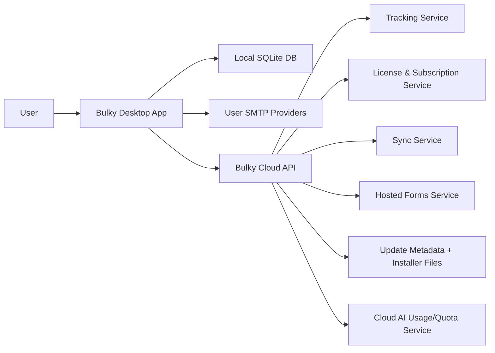
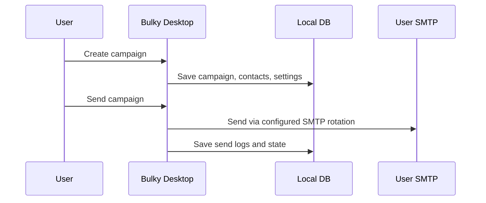
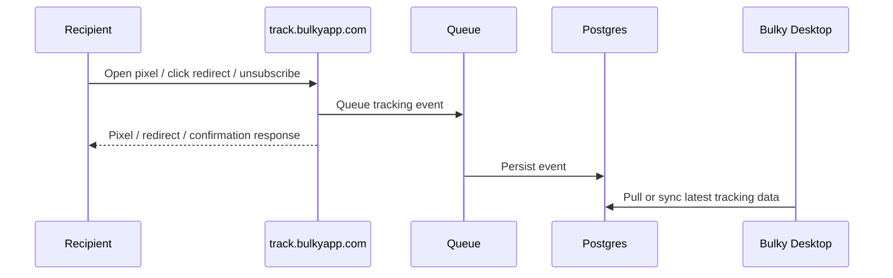
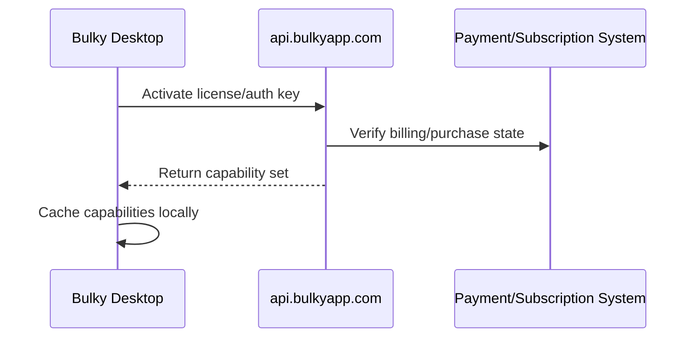
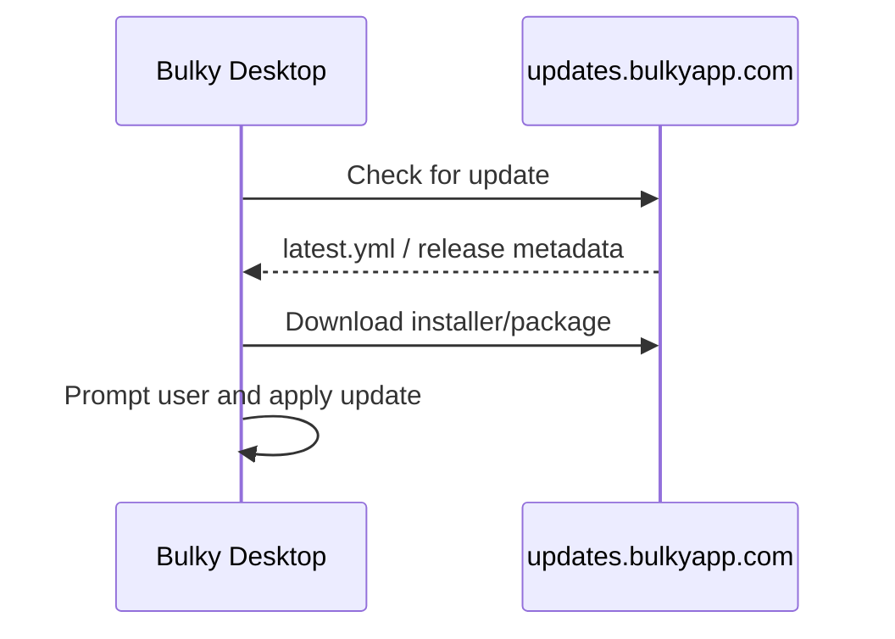

# Bulky Production Blueprint

Date: 2026-05-02
Target app: Bulky v6.1.x
Product model: One desktop application with plan-based feature unlocks

## 1. Product Identity

Bulky should remain:

- Desktop-first
- Local-first
- Bring-your-own-SMTP
- User-managed data by default

Bulky should not become a separate SaaS product or two different installers.

The production model is:

- One Bulky installer
- One Electron + React desktop application
- One entitlement/licensing system
- Two capability profiles unlocked inside the same app:
  - Local capability set
  - Hybrid capability set

## 2. Capability Model

### Local capability set

These work without Bulky Cloud:

- SMTP account setup and SMTP rotation
- Contact management, lists, tags, blacklist, local unsubscribes
- Campaign creation, scheduling, draft management, templates
- Composer, spam checker, verification tools, inbox placement views
- Local analytics from campaign logs
- Local backup and restore
- AI settings and any purely local/non-account AI workflows

### Hybrid capability set

These require Bulky Cloud and are enabled only when the plan/license allows:

- Public open tracking
- Public click tracking
- Public unsubscribe links
- Hosted signup forms and confirmation flows
- Automatic update checks and release delivery
- License activation and subscription verification
- Multi-device sync
- Cloud AI quotas, credits, or account-based usage

## 3. Current App Architecture

Bulky already has a strong local desktop backbone:

- Main process orchestration in [main.js](C:/Users/Allen/Desktop/Bulky/main.js)
- Renderer-to-main bridge in [preload.js](C:/Users/Allen/Desktop/Bulky/preload.js)
- Feature IPC owners under [ipc](C:/Users/Allen/Desktop/Bulky/ipc)
- Core services under [services](C:/Users/Allen/Desktop/Bulky/services)
- Local database in [database/db.js](C:/Users/Allen/Desktop/Bulky/database/db.js) with extracted repositories under [database/repositories](C:/Users/Allen/Desktop/Bulky/database/repositories)
- Renderer pages under [renderer/src/pages](C:/Users/Allen/Desktop/Bulky/renderer/src/pages)

Current key constraints:

- The app is local-first today.
- Tracking server is started from the desktop app and bound locally in [main.js](C:/Users/Allen/Desktop/Bulky/main.js).
- SMTP rotation is a protected core behavior in [services/emailService.js](C:/Users/Allen/Desktop/Bulky/services/emailService.js).
- Tracking and unsubscribe logic are already modeled in [services/trackingService.js](C:/Users/Allen/Desktop/Bulky/services/trackingService.js).

## 4. Target Production Architecture

### Local side

- Electron app remains the primary operational runtime
- Local SQLite remains the working database
- Campaign sending still uses user SMTP directly
- The desktop app remains usable when cloud services are unavailable, except for cloud-only features

### Cloud side

- Bulky Cloud becomes a thin service layer, not the product itself
- Cloud only supports public/shared/paid features
- No cloud service should be required for basic local sending or local data usage

## 5. Cloudflare-Centered Service Layout

Recommended domains:

- `app.bulkyapp.com`
  - marketing/download site
- `api.bulkyapp.com`
  - entitlement, sync, account APIs
- `track.bulkyapp.com`
  - opens, clicks, unsubscribes, forms
- `updates.bulkyapp.com`
  - installer assets and update metadata

Recommended Cloudflare roles:

- Cloudflare DNS
- Cloudflare proxy/WAF/rate limiting
- Cloudflare Workers for lightweight public endpoints
- Cloudflare Queues for event buffering
- Cloudflare R2 for installer/update asset storage

Recommended non-Cloudflare roles:

- Managed Postgres for Bulky Cloud data
- Paystack for subscriptions and one-off billing
- GitHub Actions or equivalent CI for builds/releases
- Optional Sentry/PostHog/Logtail-style observability later

## 6. Third-Party Service Blueprint

### Cloudflare

Use Cloudflare for:

- DNS and subdomain routing
- WAF/rate limiting around public endpoints
- Worker-based public tracking endpoints
- Queueing tracking events before persistence
- R2 object storage for update artifacts and optional form assets

### Managed Postgres

Use a hosted Postgres database for:

- License records
- Subscription state snapshots
- Device activations
- Tracking events
- Hosted form submissions
- Sync metadata
- AI usage counters

Cloudflare D1 is possible later for some workloads, but Postgres is the safer first production database for Bulky Cloud.

### Paystack

Use Paystack for:

- Freemium to paid conversion
- Pro recurring subscriptions
- One-off purchase checkout
- Recurring billing state
- Webhooks to update Bulky entitlements

### CI/CD

Use GitHub Actions or another CI system for:

- lint
- test
- renderer build
- packaged smoke checks
- installer build
- release upload
- update metadata publication

### Optional monitoring

Later add:

- Sentry for crash/error telemetry
- PostHog or a small self-hosted equivalent for product analytics
- uptime checks for `api`, `track`, and `updates`

## 7. One-App Plan Model

Bulky remains one app with plan-based feature flags.

### Freemium

- Local capability set only
- Hard local restrictions intended for trial and light usage
- Recommended starter limits:
  - up to 2,000 sent emails per billing cycle
  - up to 2 active SMTP accounts in rotation
  - no AI features
  - no hosted tracking/forms/sync
  - no advanced analytics/statistics surfaces
  - limited automation and premium deliverability tooling
- Can still validate the core Bulky local-first workflow without cloud dependence

### One-off

- Full Bulky capability set
- Includes hybrid/cloud features for 12 months from activation:
  - hosted tracking
  - hosted unsubscribe
  - hosted forms
  - updates
  - sync
  - cloud AI usage allowance
- Best sold as:
  - lifetime local desktop rights
  - 12-month bundled hosted-service access
- This protects Bulky from unlimited recurring third-party cost while still making One-off feel premium

### Pro

- Full local capability set
- Hybrid capability set unlocked
- Includes all ongoing cloud-backed services while the subscription is active:
  - hosted tracking
  - hosted forms
  - sync
  - subscription-backed verification
  - cloud AI usage
  - update and entitlement support

## 8. Entitlement Design

Entitlement should be capability-based, not edition-based.

Recommended flags:

- `can_use_local_sending`
- `can_use_multi_smtp`
- `can_use_campaign_scheduling`
- `can_use_advanced_automation`
- `can_use_statistics`
- `can_use_cloud_tracking`
- `can_use_hosted_forms`
- `can_use_auto_updates`
- `can_use_multi_device_sync`
- `can_use_cloud_ai`
- `max_monthly_sent_emails`
- `max_contacts`
- `max_campaigns`
- `max_smtp_accounts`
- `max_devices`

The desktop app should cache entitlements locally and continue working offline for local-capability features for a grace period.

## 9. Local/Hybrid Feature Boundaries

### Always local

- SMTP credentials and runtime sending behavior
- SMTP rotation execution
- Local DB for campaigns, contacts, templates, logs
- Blacklist, unsubscribe suppression, and delivery guardrails
- Renderer UI and workflow state

### Cloud-backed when enabled

- Public tracking links in outbound emails
- Public unsubscribe URLs
- Hosted form submissions
- Sync streams or snapshots
- License verification
- AI usage counters
- Release/update metadata

## 10. Core Production Flows

### A. Local sending flow

### B. Hybrid tracking flow

### C. Entitlement flow

### D. Update flow

## 11. Cloud Service Breakdown

### Tracking service

Responsibilities:

- Receive open pixels
- Receive click redirects
- Validate unsubscribe tokens
- Record event metadata
- Return fast responses without blocking on DB writes

Implementation guidance:

- Put request validation and token checks in Workers or a small API layer
- Queue heavy writes asynchronously
- Store enough metadata for analytics, but avoid unnecessary PII growth

### License/subscription service

Responsibilities:

- Activate keys
- Bind activations to devices
- Return capability flags
- Revalidate periodically
- Handle grace periods and revocation rules

### Sync service

Recommended first scope:

- settings sync
- AI account state
- optional campaign/contact sync only after local/core reliability is solid

Avoid trying to sync the entire local DB on day one.

### Hosted forms service

Responsibilities:

- accept public form submissions
- store pending submissions
- send optional double opt-in confirmations
- sync validated submissions back to Bulky desktop

### Update service

Responsibilities:

- host installer binaries
- host `latest.yml` and release metadata
- support staged rollout later

## 12. Security Blueprint

### Desktop

- Keep SMTP credentials encrypted locally where possible
- Never send SMTP passwords to Bulky Cloud
- Keep main/renderer separation strict through IPC only
- Encrypt or protect all locally cached auth/session material
- Gate privileged operations through validated IPC handlers only
- Prefer explicit allowlists over loose dynamic invocation
- Harden import/export, backup, and file-selection flows against unsafe paths and malformed content
- Minimize crash leakage of secrets into logs
- Keep local secrets out of renderer-accessible storage where possible

### Cloud

- Sign tracking/unsubscribe URLs
- Rate-limit public tracking and form endpoints
- Use short-lived auth tokens for device sessions
- Encrypt sensitive tokens/keys at rest
- Store minimal customer data required for cloud features
- Add bot/abuse detection for tracking, auth, form, and entitlement endpoints
- Add replay protection for sensitive activation and entitlement operations
- Add webhook signature validation for Paystack
- Apply per-route auth requirements and least-privilege service credentials
- Keep audit logs for entitlement, login, device, and billing-sensitive actions

### Payment/licensing

- Trust server-side Paystack webhook state, not client assertions
- Never unlock paid cloud features permanently from a client-only flag
- Cache entitlements locally with expiry and grace rules

### Error handling and breach posture

- Fail closed for cloud-only premium actions when entitlement checks are invalid
- Fail open only for already-granted local-first core operations during short cloud outages
- Centralize structured error classification for:
  - auth/session errors
  - entitlement mismatches
  - tracking endpoint abuse
  - sync conflicts
  - update failures
- Prepare incident handling for:
  - leaked API keys
  - leaked update credentials
  - compromised device sessions
  - suspicious tracking or form abuse
  - billing webhook spoof attempts

### Security operations baseline

- Secret rotation procedure for cloud API keys and service tokens
- Device/session revocation support
- Forced revalidation path for suspicious entitlement activity
- Database backup and recovery plan
- Minimal retention policy for cloud-stored event data
- Environment separation between dev, staging, and production secrets

### Threat model priorities

Primary risks Bulky should design against:

- SMTP secret leakage
- desktop session theft
- forged entitlement responses
- webhook spoofing
- hosted tracking abuse/spam
- malicious form submissions
- unsafe update delivery
- overbroad cloud data collection

## 13. Data Ownership Rules

Bulky’s trust model should stay simple:

- Local campaign/contact/template data belongs to the user and stays local by default
- Cloud only stores data needed for cloud-enabled features
- Users should be able to use Bulky meaningfully without uploading their whole dataset

Recommended cloud data minimization:

- tracking event references
- unsubscribe records needed for hosted links
- hosted form payloads
- entitlement/account records
- optional sync state only when enabled

## 14. Operational Environments

### Development

- Local Electron app
- Local SQLite
- Local tracking server
- Mock entitlement responses

### Staging

- Separate Cloudflare routes/subdomains
- Separate Postgres instance/database
- Test Paystack products and webhooks
- Staged update feed

### Production

- Production DNS
- Protected public endpoints
- Managed database backups
- Release pipeline with signed artifacts
- Security monitoring and incident-response readiness

## 15. Release Engineering Blueprint

Current local release path already includes:

- lint
- tests
- renderer build
- installer build

Production release path should add:

- artifact signing
- release notes
- publish to update host
- smoke-check installed app against production-like cloud endpoints
- rollback plan for bad releases

## 16. Recommended Delivery Order

### Phase A: Foundation

- Freeze current local architecture
- Add entitlement model to the desktop app
- Keep all existing local features working without cloud

### Phase B: Cloud foundation

- Buy/attach domain
- Configure Cloudflare DNS and subdomains
- Stand up `api`, `track`, and `updates`
- Add Postgres
- Add Paystack products and webhook processing

### Phase C: First hybrid features

- Hosted tracking
- Hosted unsubscribe links
- License activation
- Auto-update hosting

### Phase D: Second hybrid features

- Hosted signup forms
- AI account quotas
- Basic sync

### Phase E: Hardening

- observability
- staged rollouts
- rate limiting
- abuse controls
- data export/privacy controls
- security monitoring and incident response

## 17. Immediate Repo-Level Changes Recommended Later

These should eventually be added to the current codebase:

- entitlement service module in main process
- capability-aware preload API exposure or renderer guards
- configuration for cloud base URLs
- update client integration
- cloud tracking mode toggle alongside local tracking behavior
- sync adapters that do not disturb local-only usage

## 18. Final Recommendation

Bulky should launch as:

- one desktop application
- local-first by default
- hybrid by entitlement
- BYO SMTP always
- cloud only where cloud is technically necessary

That preserves Bulky’s identity while still giving you a real path to:

- subscriptions
- hosted tracking
- updates
- sync
- cloud-backed premium features
